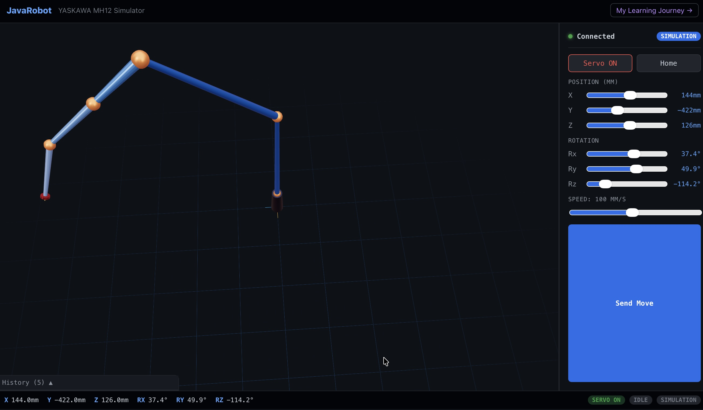

# JavaRobot

A project I started in November 2016 to learn how to code — by controlling a **YASKAWA Motoman MH12** 6-DOF industrial robotic arm over UDP. What began as a single Java class has evolved into a full-stack web simulator with a 3D browser UI.

> This repository is structured to show my learning journey, from the very first commit to a modern React + Three.js application.


---

## Project Structure

```
JavaRobot/
├── legacy/
│   ├── v1/           Nov 2016 — first attempt, all-in-one Java class
│   ├── v2/           Dec 2016 — UDP abstracted, first working demo
│   ├── v3/           Dec 2016 — stabilized rotation matrix comparison
│   ├── java-v1.3/    Jan 2018 — final production release (JAR)
│   └── matlab/       Mar 2017 — MATLAB wrappers for lab use
│
├── core/             Java library source (v1.3), Maven project
│
├── server/           Node.js + Express + Socket.io simulation server
│
├── webapp/           React + Three.js 3D browser simulator
│
└── docs/             Documentation and presentation slides
```

---

## Running Locally

### Prerequisites
- Node.js 18+
- npm

### Start the server
```bash
cd server
npm install
npm run dev
# Server: http://localhost:8080
```

### Start the frontend
```bash
cd webapp
npm install
npm run dev
# App: http://localhost:5173
```

### With Docker Compose
```bash
docker-compose up
# App: http://localhost:3000
```

---

## Architecture

```
Browser (React + Three.js)
    │  REST /api/v1/robot/*
    │  WebSocket (Socket.io) /topic/robot-state @ 20Hz
    ▼
Node.js Server (Express + Socket.io)
    │
    ├── SimulationEngine  — virtual robot at 50Hz tick rate
    │     trapezoidal velocity profile, S-curve smoothing
    │
    └── (future) HardwareService → UDP → DX200 Controller @ 192.168.2.250
```

**Key design decisions:**
- **Simulation first** — no hardware needed. The sim engine faithfully replicates the DX200 behavior including servo interlock and async movement.
- **Same rotation math** — `kinematics.ts` is a direct TypeScript port of `RobotRotation.java` from 2017. Same ZYX Euler convention, same singularity handling.
- **ROS-ready interface** — `RobotInterface` is designed so a `RosBridgeRobot` can be swapped in without changing the server layer.
- **Swarm-ready** — all state is keyed by `robotId`. Multi-robot support is a config change away.

---

## The Learning Journey

Visit `/journey` in the app to see an interactive timeline of how this project evolved. Or read the [legacy/](legacy/) source directly — each version folder has a README dated to its original commit.

**Milestones:**
| Date | Version | What I learned |
|------|---------|----------------|
| Nov 2016 | v1 | Java basics, UDP sockets |
| Dec 23, 2016 | v2 | Byte parsing, first demo |
| Dec 2016 | v3 | Rotation matrices, singularities |
| Jan 2018 | v1.3 | Command pattern, immutable data |
| Mar 2017 | MATLAB | API design, lab integration |
| Apr 2026 | Web | React, Three.js, TypeScript IK |

---

## Original Java Library (v1.3)

The original library sends MOTOCOM32 UDP commands directly to the DX200 controller.

**Communication:**
- Robot IP: `192.168.2.250`, port `10040`
- Protocol: custom binary UDP (YERC header + payload)
- Position units: mm (integer), rotation units: 0.0001 degrees

**Java packages:**
```
rfvlsi.Robot
├── JavaRobot          — main interface
├── UDPNode            — UDP socket layer
├── RobotPosition      — immutable position data
├── RobotMoveThread    — async movement thread
├── RobotRotation      — 3×3 rotation matrix math
└── RobotCommand/
    ├── CommandMove
    ├── CommandServoOn/Off
    ├── CommandHoldOn/Off
    └── CommandAlertRead/Reset
```

---

## License

Original work © Y.W. Chen, RFVLSI/NCTU. Available for research purposes.
